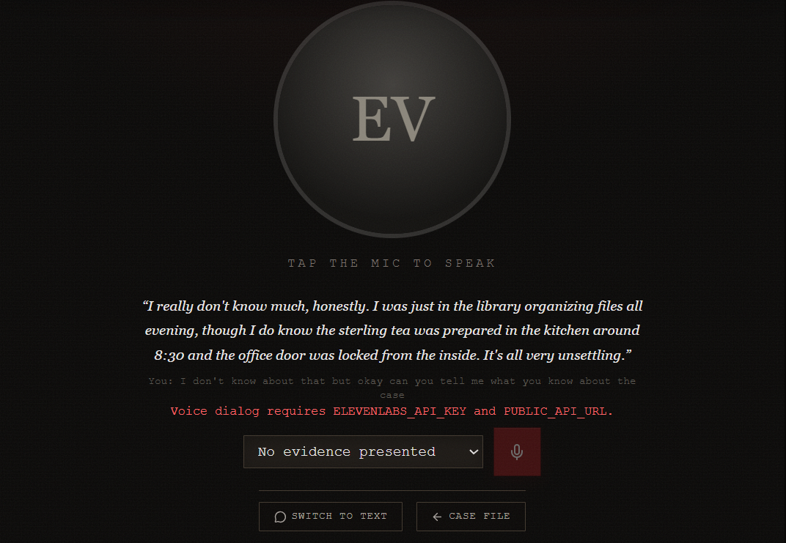

# Dossier (CuHacking 7)

A single-player, browser-based AI detective game. Pick a case from the
commission dashboard, read the briefing, review the evidence, interrogate
Gemini-powered suspects by text or voice, and submit a final accusation —
then watch the whole case get reconstructed in front of you.

Built as a hackathon MVP for cuHacking.



## Table of Contents

- [Overview](#overview)
- [Features](#features)
- [Tech Stack](#tech-stack)
- [Architecture](#architecture)
- [Project Structure](#project-structure)
- [Getting Started](#getting-started)
- [Environment Variables](#environment-variables)
- [Game Mechanics](#game-mechanics)
- [API Reference](#api-reference)
- [Deployment](#deployment)
- [Development Notes](#development-notes)
- [Documentation](#documentation)
- [Git Workflow](#git-workflow)
- [Scope](#scope)

## Overview

The player is an investigator working a case for a commission. There are no
dialogue trees — every suspect is an independent Gemini-powered agent with
its own personality, background, secrets, and knowledge boundaries, and the
player can ask them anything, by typing or by speaking. Suspects react with
emotion, hesitate, get defensive, lie to protect themselves or someone else,
and their trust/patience toward the player shift turn by turn. Presenting the
right piece of evidence at the right moment can crack a story open.

Once the player is confident, they submit an accusation — a suspect, a
motive, an explanation, and the supporting evidence — and the commission
reveals whether they got it right, along with the full canonical timeline and
everything they missed.

A lightweight progression layer sits on top: a reputation score, detective
tiers, a global leaderboard, and player profiles with case history.

## Features

- **Commission dashboard** — a docket that always holds a handful of
  available cases; solved cases retire and are silently replaced by
  background Gemini generation (no player-facing "generate" button)
- **Case briefing** — victim profile, crime scene, public timeline, suspect
  roster, and initial evidence, with the solution kept strictly private
  until resolution
- **Investigation workspace** — suspect dossiers, an evidence board with a
  reviewed/unreviewed tracker, and an auto-saving case journal (notes).
  Photo and CCTV evidence carry a generated still image, not just text.
- **Interrogation room** — free-form questioning of independent AI suspect
  agents, by text or by live voice dialog:
  - Replies stream token-by-token over Server-Sent Events
  - Each suspect carries **Trust** and **Patience** meters that shift with
    every answer; patience hitting zero ends the conversation for good
  - Evidence can be presented mid-conversation to provoke a reaction
  - A wide emotional range — calm, nervous, defensive, angry, sad, evasive,
    confident, frightened/**terrified**, **amused**, **sarcastic**, and
    **crying** — each mapped to real Eleven v3 audio-tag deliveries that
    intensify with `emotion_intensity` (a mild `[chuckles]` versus a full
    `[laughs sarcastically]`, a `[voice shaking]` versus outright `[panicked]`)
  - A credible threat is a second lever besides trust: real fear can push a
    suspect to blurt out something true despite low trust, exactly like
    building trust does — pressure isn't only a patience penalty
  - Walking out of an active conversation puts that suspect on a **3-minute
    cooldown** before they'll speak with the player again
- **Bespoke suspect voices** — rather than recycling a handful of stock
  voice IDs, each generated suspect gets an ElevenLabs **Voice Design**
  voice built from their own casting note (age, gender, accent/timbre), so a
  suspect's voice actually matches their stated age and background instead
  of defaulting to the same generic cast every case
- **Voice dialog** — a hands-free, face-to-face conversation mode built on
  ElevenLabs' speech engine, bridged over a WebSocket so the suspect's voice,
  the player's microphone, and the game's own agent logic all stay in sync
- **Verdict & resolution** — accuse a suspect, gain or lose reputation, and
  see the full case reconstruction: actual culprit, motive, canonical
  timeline, why innocent suspects were hiding things, and the clues missed
- **Progression** — reputation score with detective tiers (Rookie → Inspector
  → Senior → Master → Legend), a global leaderboard, and player profiles with
  solve/fail history
- **Guest or Google auth** — dev-bypass guest mode out of the box, or Clerk
  Google Sign-In when configured
- **Versus (coming soon)** — the multiplayer menu is visible but
  intentionally locked for this build

## Tech Stack

| Layer          | Technology                                                  |
| -------------- | ------------------------------------------------------------ |
| Frontend       | React 19 + TypeScript + Vite + Tailwind CSS v4                |
| State          | Zustand                                                        |
| Backend        | FastAPI (Python 3.12), Motor (async MongoDB driver)            |
| Database       | MongoDB                                                        |
| AI — dialogue  | Gemini API (`google-genai`) — suspect agents & case generation |
| AI — voice     | ElevenLabs (TTS + realtime speech engine for voice dialog)     |
| AI — images    | Replicate (`black-forest-labs/flux-schnell`) — suspect portraits + photo/cctv evidence stills |
| Media storage  | Cloudinary (re-hosts generated images so URLs don't expire)   |
| Auth           | Clerk (Google Sign-In) or dev-bypass guest mode                |
| Transport      | REST + Server-Sent Events (streamed suspect replies) + WebSocket (voice dialog) |
| Deployment     | Docker Compose (local) · Vercel multi-service (frontend + backend) |

## Architecture

```text
┌──────────────────────────┐
│   React SPA (frontend)   │
└─────────────┬─────────────┘
              │ REST + SSE + WebSocket
              ▼
┌──────────────────────────┐        ┌───────────────┐
│    FastAPI (backend)     │──────▶ │  Gemini API   │  suspect agents,
│                          │        │               │  case generation
│  cases · investigations  │──────▶ │  ElevenLabs   │  TTS + voice dialog
│  interrogation · verdict │──────▶ │  Replicate    │  portraits + evidence
│  audio · users           │──────▶ │  Cloudinary   │  image re-hosting
└─────────────┬─────────────┘        └───────────────┘
              ▼
┌──────────────────────────┐
│        MongoDB           │
│ cases · investigations   │
│ interrogations · users   │
└──────────────────────────┘
```

The frontend **never** calls Gemini, ElevenLabs, Replicate, Cloudinary, or
MongoDB directly — everything goes through the FastAPI backend.

### The one rule that matters: public vs. private case data

A case document stores both the player-facing briefing **and** the solution.
Anything the player must not see before resolution lives in `Suspect.private`,
`Case.canonical_timeline`, or `Case.solution`
([backend/app/models/case.py](backend/app/models/case.py)). Every endpoint
response is sanitized through
[backend/app/services/sanitize.py](backend/app/services/sanitize.py) before
it reaches the client — the resolution view is only reachable after a verdict
has actually been stored.

## Project Structure

```text
.
├── backend/
│   ├── app/
│   │   ├── api/            # routers: cases, investigations, interrogation,
│   │   │                    # verdict, audio, users
│   │   ├── core/            # config, db, auth (dev bypass / Clerk JWKS), rate limiting
│   │   ├── models/           # Pydantic models (Case, Suspect, Evidence,
│   │   │                    # Investigation, SuspectReply, ...)
│   │   ├── services/         # gemini.py, prompts.py, voice.py, speech_engine.py,
│   │   │                    # images.py, sanitize.py, seed.py, case_pool.py
│   │   └── data/             # handcrafted demo_case.json, auto-seeded on startup
│   └── scripts/               # seed_demo_case.py, backfill_portraits.py, test_image_gen.py
├── frontend/
│   └── src/
│       ├── pages/             # Dashboard, Briefing, Investigation, Interrogation,
│       │                      # Accusation, Resolution, Leaderboard, Profile, ...
│       ├── components/        # Header, Meter, StatCard, SuspectPortrait, TierBadge
│       ├── lib/                # api.ts (typed fetch + SSE client), auth.tsx, time.ts
│       └── store/              # investigationStore.ts (Zustand)
├── docs/
│   └── GDD.md                  # authoritative game design document
├── docker-compose.yml
├── vercel.json                 # multi-service (frontend + backend) Vercel config
└── CLAUDE.md                    # architecture notes & conventions for AI-assisted dev
```

## Getting Started

### Prerequisites

- Docker + Docker Compose (recommended path), **or** Python 3.12 + Node.js
  ≥ 20.19 + pnpm for a manual setup
- A [Gemini API key](https://aistudio.google.com/apikey) to enable suspect
  replies and case generation (the app still boots and the seeded demo case
  is browsable without one — those endpoints just return `503`)

### Quick start (Docker)

```bash
cp .env.example .env   # fill in GEMINI_API_KEY at minimum
docker compose up --build
```

| Service  | URL                          |
| -------- | ---------------------------- |
| Frontend | http://localhost:5173         |
| Backend  | http://localhost:8000/docs    |
| MongoDB  | mongodb://localhost:27017      |

On first boot the backend seeds one handcrafted demo case ("The Gallery After
Hours"), so the game is playable immediately. Both containers hot-reload —
source directories are volume-mounted.

> After editing `.env`, use `docker compose up -d` rather than
> `docker compose restart` — a plain restart does not reload the env file and
> will silently keep the old values.

### Without Docker

```bash
# Mongo — run your own instance, or point MONGODB_URI at Atlas

# Backend
cd backend
python -m venv .venv && . .venv/Scripts/activate   # . .venv/bin/activate on macOS/Linux
pip install -r requirements.txt
uvicorn app.main:app --reload   # http://localhost:8000, docs at /docs

# Frontend (separate shell)
cd frontend
pnpm install
pnpm dev   # http://localhost:5173
```

### Useful commands

```bash
# Frontend (frontend/)
pnpm dev            # Vite dev server with HMR
pnpm type-check      # tsc -b, no emit
pnpm build           # type-check + production build
pnpm preview          # preview the production build

# Backend (backend/)
uvicorn app.main:app --reload
python -m scripts.seed_demo_case [--force]   # re-seed the handcrafted demo case
python -m scripts.backfill_portraits          # generate/backfill missing suspect portraits
python -m scripts.backfill_evidence_images    # generate/backfill missing photo/cctv evidence images
python -m scripts.backfill_voices             # design/backfill missing suspect voices
```

There are no automated tests yet — verify changes by running the stack and
walking the flow: dashboard → briefing → interrogate → accuse → resolve.

## Environment Variables

Copy `.env.example` to `.env` at the repo root; Docker Compose passes it
through to the backend container.

| Variable | Purpose |
| --- | --- |
| `GEMINI_API_KEY` | Suspect replies, case generation, verdict analysis. Missing → those endpoints return `503`, rest of the app still works. |
| `GEMINI_CHAT_MODEL` / `GEMINI_CASE_MODEL` | Model overrides for interrogation vs. case generation. |
| `ELEVENLABS_API_KEY` | Voice playback (TTS), hands-free Voice Dialog, and per-suspect Voice Design. Missing → TTS fails soft, text chat still works, suspects fall back to the stock voice pools. |
| `ELEVENLABS_VOICE_DESIGN_MODEL` | Model used to design each suspect's bespoke voice from their `voice_description` casting note. |
| `ELEVENLABS_STABILITY` | v3 only honors 0.0/0.5/1.0 (Creative/Natural/Robust). Defaults to `0.0` for the widest emotional range and best audio-tag responsiveness. |
| `ELEVENLABS_*` | Stock voice IDs by gender (fallback only — used when Voice Design hasn't run or ElevenLabs isn't configured), output audio format, turn-taking eagerness/timeout, session length, similarity tuning. |
| `PUBLIC_BACKEND_URL` | Public HTTPS URL forwarding to the backend (e.g. an ngrok tunnel to :8000) — required for Voice Dialog so ElevenLabs can reach the WSS bridge. |
| `REPLICATE_API_TOKEN` / `REPLICATE_IMAGE_MODEL` | Suspect portrait generation. |
| `STORAGE_PROVIDER`, `CLOUDINARY_*` | Re-hosts generated images so URLs outlive the generation provider's own (often temporary) links. Swappable — see `backend/app/services/storage/`. |
| `DEV_AUTH_BYPASS` | `true` (default) resolves every request to `dev-user` and shows "Continue as Guest". Set `false` + `CLERK_JWKS_URL` for real Google Sign-In. |
| `CLERK_JWKS_URL` / `CLERK_ISSUER` | Clerk JWT verification for the backend. |
| `ENVIRONMENT` | `development` \| `production`. Production refuses to boot with `DEV_AUTH_BYPASS=true`. |
| `CASE_POOL_SIZE` | How many "available" cases the commission keeps on the docket at once (default 3). |
| `CASE_MIN_SUSPECTS` / `CASE_MAX_SUSPECTS` / `CASE_MIN_EVIDENCE` / `CASE_MAX_EVIDENCE` | Shape of newly generated cases. |
| `MONGODB_URI` / `MONGODB_DB` | Overridden by `docker-compose.yml` in Docker; used as-is for bare-metal runs. |
| `VITE_API_URL` | Base URL the frontend calls; Vite reads this from `.env` for local dev. |
| `CORS_ORIGINS` | Comma-separated origins the backend will accept requests from. |

Frontend-only: `frontend/.env.local` (gitignored) holds
`VITE_CLERK_PUBLISHABLE_KEY`, pulled with `clerk env pull` — it is
deliberately *not* passed through `docker-compose.yml`; the mounted
`.env.local` is the single source of truth for it.

## Game Mechanics

- **Trust (starts 50) / Patience (starts 100)**, tracked per suspect per
  investigation. Every suspect reply suggests deltas (`trust_change` −15..+15,
  `patience_change` −25..+10); the backend clamps the result to 0–100.
  Patience hitting 0 ends that conversation permanently.
- **Cooldown** — walking out of an active interrogation (switching screens
  mid-conversation) starts a 3-minute cooldown on that suspect; messages sent
  during the cooldown are rejected with a 429 and the case-file / dossier
  views show a live countdown in place of the "Interrogate" action.
- **Suspect knowledge boundaries** — each agent's system prompt contains only
  its own `known_facts` / `unknown_facts` / `knows_about_others`. Only the
  culprit's prompt ever references the actual crime details.
- **Case pool** — the commission always keeps `CASE_POOL_SIZE` cases
  available; top-ups run in the background (on startup, after a correct
  verdict, and self-healing from `GET /api/cases`). Players never trigger
  generation themselves.
- **Verdict correctness** is decided entirely by the backend
  (`accused_id == solution.culprit_id`) — Gemini only writes the flavor text
  for the commission's review, it never decides right or wrong.
- **Reputation & tiers** — correct verdict: `+75 + difficulty × 5`; wrong:
  `−50`, floored at 0. Tiers: Rookie 0 / Inspector 300 / Senior 800 /
  Master 1500 / Legend 2000.
- Conversation history sent to Gemini is capped at the last 12 messages per
  suspect to keep prompts small.
- **Bespoke voices** — case generation writes a `voice_description` casting
  note per suspect (gender, age register, accent/timbre); `services/voice_design.py`
  turns that into a permanent ElevenLabs voice via the Voice Design API
  (`/text-to-voice/design` → `/text-to-voice`) the first time the case is
  generated, so the voice is fixed for the life of the case. Falls back to a
  small stock masculine/feminine voice pool when ElevenLabs isn't configured
  or design fails for a suspect. Re-run for existing pooled cases with
  `python -m scripts.backfill_voices`.

## API Reference

All routes are under `/api`, bearer-token authenticated (guest token in dev
bypass mode). Full interactive docs at `/docs` (Swagger) once the backend is
running.

```text
GET  /api/me
GET  /api/profile
GET  /api/leaderboard

GET  /api/cases
POST /api/cases/generate            # dev/demo utility — players never call this
GET  /api/cases/{case_id}

POST /api/investigations
GET  /api/investigations/active
GET  /api/investigations/{id}
PUT  /api/investigations/{id}/notes
GET  /api/investigations/{id}/suspects
GET  /api/investigations/{id}/evidence
POST /api/investigations/{id}/evidence/{evidence_id}/review

GET  /api/investigations/{id}/suspects/{suspect_id}/messages
POST /api/investigations/{id}/suspects/{suspect_id}/messages   # SSE stream
POST /api/investigations/{id}/suspects/{suspect_id}/leave      # starts the cooldown

POST /api/audio/synthesize                                    # TTS for a stored message
POST /api/audio/speech-engine/token/{id}/{suspect_id}          # voice dialog session token
WS   /api/audio/speech-engine/ws                               # voice dialog bridge

POST /api/investigations/{id}/verdict
GET  /api/investigations/{id}/resolution
```

### Interrogation SSE protocol

`POST .../messages` responds `text/event-stream`:

- `token` — `{"text": "..."}`, streamed live as Gemini generates the reply
- `meta` — the full stored message once persisted (emotion, trust/patience
  before/after, `conversation_ended`)
- `error` — `{"detail": "..."}`

A leak guard replaces any reply containing system-prompt markers with an
in-character deflection before it's ever sent to the client. See
[frontend/src/lib/api.ts](frontend/src/lib/api.ts) `streamMessage()` for the
client-side parser.

## Deployment

`vercel.json` defines two services from one repo — `frontend` (Vite, static
build) and `backend` (FastAPI) — with `/api/*` rewritten to the backend
service and everything else served as the SPA. Locally, Docker Compose is the
supported path; there is no CI pipeline yet.

## Development Notes

- The larger Detective K app lives in a separate repo (`detective-k-game`,
  Vue + Supabase) — vendored here as **read-only reference material only**;
  never modify it from this project.
- No `suspects` / `evidence` collections — they're embedded directly in the
  `cases` document. Collections: `cases`, `investigations`, `interrogations`
  (one doc per Q/A exchange), `users`.
- TTS audio is cached in-memory per message, not persisted — `audio_url`
  exists on the message model but is currently always null.
- **Evidence images** — case generation writes `canonical_facts` (2-4
  purely-observational bullets) for every `photo`/`cctv` evidence item;
  `services/images.add_evidence_images()` turns those into a Replicate-generated
  still image the first time the case is generated, re-hosted through
  Cloudinary like suspect portraits. `cctv` gets a still frame, not real
  video — see the Veo note below. Re-run for existing pooled cases with
  `python -m scripts.backfill_evidence_images`.
- Not yet implemented: Veo-generated CCTV *video* evidence (`cctv` evidence
  today is a generated still image, not a video clip), a relationship map, an
  interactive timeline, and automatic contradiction highlighting.

## Documentation

- [docs/GDD.md](docs/GDD.md) — the authoritative game design document:
  gameplay loop, every screen, the full suggested API surface, build
  priorities, and what's explicitly out of scope
- [CLAUDE.md](CLAUDE.md) — architecture, conventions, game mechanics detail,
  and guidance for AI-assisted development in this repo

## Git Workflow

- Never commit directly to `main` or `dev`
- Branch from `dev`: `feature/<name>`; merge into `dev` and delete the branch
  once approved
- `dev` is promoted to `main` after review
- Conventional commits (`feat(backend): ...`, `fix(frontend): ...`, `chore:`,
  `docs:`) — no AI co-author trailers

## Scope

Reputation/tiers, a global leaderboard, and player profiles are in scope (see
the amendment in `docs/GDD.md` §11). Out of scope for this build: multiplayer
functionality (the Versus menu exists but stays locked "coming soon"),
credits/XP/payments, achievements, Telegram integration, reputation decay,
and a 3D crime scene — evidence stays text/media cards only. Check
`docs/GDD.md` §11 before adding anything that might fall outside this list.
